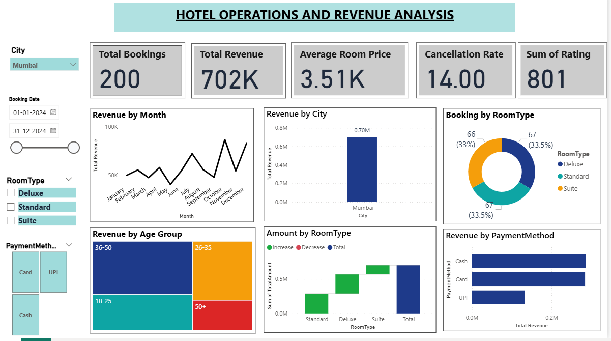
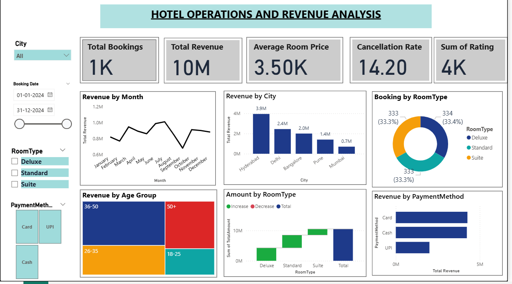

#  Hotel Management Analytics System

##  Objective
Developed a data-driven hotel management system to analyze booking data, revenue trends, and occupancy rates using SQL and Power BI.

## Tools & Technologies
- SQL
- Power BI
- Excel

##  Key Features
- Designed relational database with multiple tables (PK–FK relationships)
- Performed data cleaning and analysis using SQL (joins, aggregations)
- Built interactive Power BI dashboards
- Created KPIs: Revenue, Occupancy Rate, Booking Trends

##  Insights
- Identified peak booking periods and revenue trends
- Analyzed customer booking patterns
- Improved visibility of hotel performance metrics

## Files Included
- hotel-management-pbix

